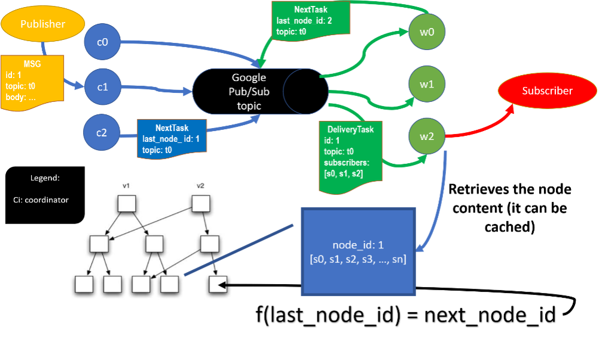

# Scalable Pub/Sub System

The system uses the Immutable BTree to store the topic subscribers information. Since each leaf node of the tree can hold up  to hundreds of subscribers for each topic, a simple message delivery task can be associated to each node (one task delivers to multiple subscribers). That way we can use a queue/log system to send these tasks to in order to amortize the pressure in the system. For that job, the Google Cloud Pub/Sub is a great candidate, since it is cheap and supports the acknowledgment of finished tasks (removed after processing – this saves storage). To reduce the pressure in the system even more, workers can process a batch of tasks at any given moment. Messages that belong to the same topic can be aggregated and delivered together.  
The message system is not bombarded with tasks from all nodes of some topic at the same time. The Index tree has an idempotent function that, given some leaf id (task id), it can retrieve the next leaf. So, using this approach, we can iterate lazily over the topic subscribers, i.e., for any given topic, there could be one or n (configurable) tasks waiting in the queue to be processed! This mechanism allows for the custom parallelization of the processing. If we need to scale the system’s capability, we can increase the number of workers, the number of subscribers per leaf node and the batch size of the workers.
The diagram below shows the high level overview of the system: 

	 